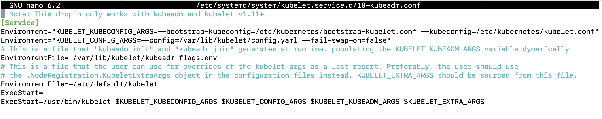
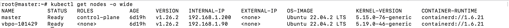

# The documentation for init kubernetes cluster

## Quick start ⚡
- [Initialization the k8s cluster](#initialization)
- [Join worker node to cluster](#worker-join)
- [Network Plugin - Calico](#calico)

## INITIALIZATION
- SSH to virtual machine with `ssh root@192.168.1.200` with password is `123`.
- Init cluster with the following listing commands
```bash
kubeadm init --apiserver-advertise-address=192.168.10.100 --pod-network-cidr=192.168.0.0/16

mkdir -p $HOME/.kube
sudo cp -i /etc/kubernetes/admin.conf $HOME/.kube/config
sudo chown $(id -u):$(id -g) $HOME/.kube/config
```
After run `kubeadm init` command, the output has shown the command for other worker nodes join to the cluster like this <br>
`kubeadm join 10.0.2.15:6443 --token t6hych.vq9zb7fq3iatih7d \
	--discovery-token-ca-cert-hash sha256:a93b93a007d09ce77c21b51c6123b7b7fe504cb4301b96bdcc1e70c71e512b41`
<br><br>

## WORKER-JOIN
In worker node, run the `kubeadm join` command above with sudo privileged. If you are forget the command, run `kubeadm token create --print-join-command` in master node
<br><br>
**Note:** If worker not turn off the swap with `swapoff -a` command. Please make sure add `--fail-swap-on=false` into kubelet configurations file `/etc/systemd/system/kubelet.service.d/10-kubeadm.conf` before run the `kubeadm join` command.<br> <br>
 <br><br>
After that, run following commands
```bash
sudo systemctl daemon-reload
sudo systemctl restart kubelet
```

## CALICO
In order to make the cluster can work, we need to install network plugin. In this case, we are using [Calico](https://www.tigera.io/project-calico/). In master node, run the command <br>
`kubectl apply -f https://raw.githubusercontent.com/projectcalico/calico/v3.25.0/manifests/calico.yaml`
<br><br>
After completing all the steps, run the following command on the master node to check the information of all nodes and verify that they are working correctly. <br>
`kubectl get nodes -o wide` <br>
The output as shown below
