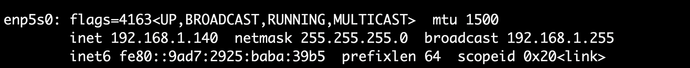

# Documentation for creating a virtual machine with ubuntu/jammy64 based image by vagrant

## Quick start ⚡
- [Prerequisites](#prerequisites)
- [Create virtual machine](#virtual-machine)
- [Explanation](#explanation)

## PREREQUISITES
[Download and install virtualbox](https://www.virtualbox.org/wiki/Downloads)

## VIRTUAL-MACHINE
- Open the terminal window.
- Type commands below into the terminal window to create a virtual machine.
```bash
cd vagrant/master
chmod +x ../install-docker-kube.sh
vagrant up
```

## EXPLANATION
- The `install-docker-kube.sh` file contains all necessarily libraries like Docker, Kubernetes, etc.
- Basic settings for virtual machine
```bash
Vagrant.configure("2") do |config|
  config.vm.box = "ubuntu/jammy64"
  config.vm.network "public_network", bridge: "enp5s0", ip: "192.168.1.200"
  config.vm.hostname = "master.rainscales"
  config.ssh.insert_key = false

  config.vm.provider "virtualbox" do |vb|
    vb.name = "master.rainscales"
    vb.cpus = 4
    vb.memory = "5120"
  end
```
We're using static IP (192.168.1.200) for virtual machine. The setting can be `config.vm.network "private_network", ip: "192.168.1.200` in the case you are testing with your laptop in home network. <br>
If it's not work after ssh to the virtual machine. Using `ifconfig` (ubuntu), find your network interface (`enp5s0` in this case) and using the above setting with `public_network`.
 <br><br>
The master node requires a minimum of **2 cores** and **2 GB** of memory. <br><br>
Using `config.vm.provision` to install or modify some other settings (example: set password for root account, etc). <br><br>
We need to modify the /etc/hosts file and add an additional line as shown below
```bash
# Add entries to /etc/hosts file for accessing machines via hostname
cat >> /etc/hosts << EOF
192.168.1.200 master.rainscales
EOF
```
If your cluster has N nodes, we need to modify the /etc/hosts file on each node and add the hostname for all nodes. This allows each node to identify the hostnames of the other nodes.

**Note:** In Vagrantfile, we using<br>
`sed -i 's|^Environment="KUBELET_CONFIG_ARGS=.*|Environment="KUBELET_CONFIG_ARGS=--config=/var/lib/kubelet/config.yaml --node-ip=192.168.1.200"|' /etc/systemd/system/kubelet.service.d/10-kubeadm.conf`
<br>
to make sure master node in k8s cluster using private node IP 192.168.1.200 instead of 10.\*.\*.\* IP from bridge interface.